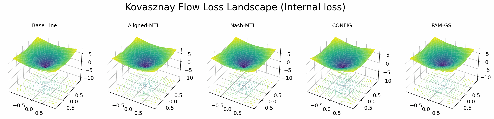
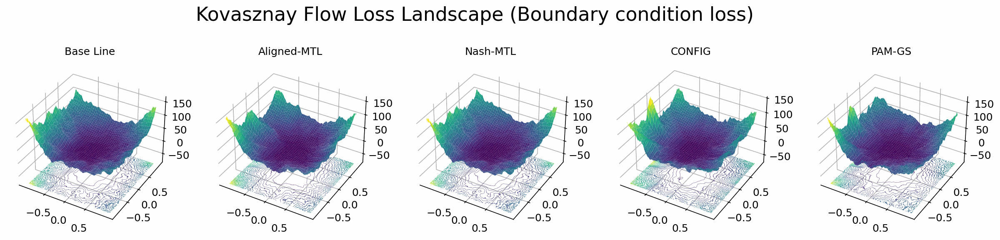
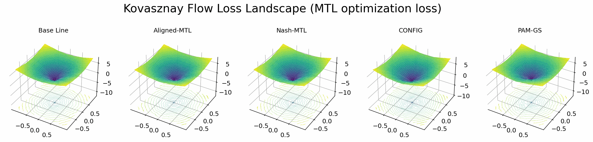

# Gradient Surgery for Physics-Informed Neural Networks
Official implementation of the Gradient surgery methods for training Physics-Informed Neural Networks (under review at ACML)

Physics-Informed Neural Networks (PINNs) are trained by optimising a composite objective that combines data fitting with physics-based constraints, typically resulting in a highly imbalanced multi-task optimisation problem. In this setting, existing optimisation strategies are affected by conflicting task gradients, leading to slow convergence and unstable training, particularly for stiff and high-frequency partial differential equations. We investigate Multi-Task Deep Learning (MTDL) optimisation methods and analyse gradient conflicts throughout training of PINNs. Our analysis shows that angle-based gradient conflicts are predominant during the early stages of optimisation, whereas magnitude-based conflicts become the primary bottleneck later in training. Building on these observations, we propose PAM-GS, a physics-aware gradient surgery method that adaptively mitigates task interference during training according to the observed conflict regime. Experiments on four representative PDE benchmarks demonstrate that PAM-GS consistently improves both convergence balance and solution accuracy compared with existing optimisation methods.

---

<p align="center"> 
    
</p>
<p align="center"> 
    
</p>
<p align="center"> 
    
</p>

Loss landscape of the 2D Kovasznay flow across optimisers. Panels show $\log_{10}$ training loss over a 2D PCA subspace with iso-contours and learning trajectories (blue) on the loss 3D surface and 2D projection.

---


## Experiments

### Setup environment

Create the virtual environment and install project dependencies:

```bash
cd gs_pinn
uv sync
```

### Project structure

The file hierarchy should look like:

```
gs_pinn
 ├─ data                          # dataset folder containing MTL data
 ├─ src
 │  ├─ experiments
 │  │  ├─ beltrami
 │  │  │  ├─ conf                # configuration files for experiments
 │  │  │  └─ trainer.py          # main training script
 │  │  ├─ burgers
 │  │  │  ├─ conf
 │  │  │  └─ trainer.py
 │  │  ├─ kovasznay
 │  │  │  ├─ conf
 │  │  │  └─ trainer.py
 │  │  └─ schrodinger
 │  │     ├─ conf
 │  │     └─ main.py
 │  └─ methods
 │     └─ weight_methods.py      # different MTL optimizers
 ├─ run.sh                       # script to run experiments
```

### Run experiments

The `run.sh` script acts as a template for launching experiments. It uses Hydra for configuration management.

Available parameters and options can be found in the `conf` directories under each experiment module.

To run an experiment:

```bash
bash run.sh
```

### MTL methods

We support the following MTL methods with a unified API. To run experiment with MTL method `X` simply run:
```bash
python trainer.py --method=X
```

| Method (code name) | Paper (notes) |
| :---: | :---: |
| ConFIG (`config`) | [ConFIG: Towards Conflict-free Training of Physics Informed Neural Networks](https://arxiv.org/pdf/2408.11104)
| Aligned-MTL (`alignedmtl`) | [Independent Component Alignment for Multi-Task Learning](https://openaccess.thecvf.com/content/CVPR2023/papers/Senushkin_Independent_Component_Alignment_for_Multi-Task_Learning_CVPR_2023_paper.pdf) |
| FAMO (`famo`) | [Fast Adaptive Multitask Optimization](https://arxiv.org/abs/2306.03792.pdf) |
| Nash-MTL (`nashmtl`) | [Multi-Task Learning as a Bargaining Game](https://arxiv.org/pdf/2202.01017v1.pdf) |
| CAGrad (`cagrad`) | [Conflict-Averse Gradient Descent for Multi-task Learning](https://arxiv.org/pdf/2110.14048.pdf) |
| PCGrad (`pcgrad`) | [Gradient Surgery for Multi-Task Learning](https://arxiv.org/abs/2001.06782) |
| IMTL-G (`imtl`) | [Towards Impartial Multi-task Learning](https://openreview.net/forum?id=IMPnRXEWpvr) |
| MGDA (`mgda`) | [Multi-Task Learning as Multi-Objective Optimization](https://arxiv.org/abs/1810.04650) |
| DWA (`dwa`) | [End-to-End Multi-Task Learning with Attention](https://arxiv.org/abs/1803.10704) |
| Uncertainty weighting (`uw-so`) | [Multi-Task Learning Using Uncertainty to Weigh Losses for Scene Geometry and Semantics](https://arxiv.org/pdf/1705.07115v3.pdf) |
| SAM-gs (`smgs`) | [Gradient Similarity Surgery in Multi-task Deep Learning](https://arxiv.org/abs/2506.06130) |
| Linear scalarization (`ls`) | - (equal weighting) |
| Scale-invariant baseline (`scaleinvls`) | - (see Nash-MTL paper for details) |

